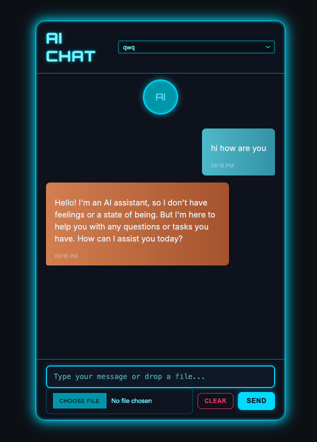

# Futuristic Ollama Chat



A sleek, futuristic-themed AI chat application powered by Ollama for local large language model integration. Built with a Python/FastAPI backend using Pydantic AI, and a dynamic TypeScript frontend.

## Features

*   **Futuristic User Interface:** Neon-themed, responsive chat interface.
*   **Local LLM Integration:** Connects to local Ollama instances to run various open-source language models.
*   **Model Selection:** Allows users to choose from available Ollama models.
*   **Markdown Rendering:** Displays model responses with Markdown support, including code blocks with a copy button.
*   **File Upload (Basic):** Includes a basic file input (functionality can be expanded).
*   **Persistent Chat History (per session):** Chat messages are fetched on load.
*   **Clear Chat:** Option to clear the current chat conversation.

## Tech Stack

*   **Backend:**
    *   Python
    *   FastAPI
    *   Pydantic AI
    *   Ollama
    *   Uvicorn (for serving)
*   **Frontend:**
    *   HTML5
    *   CSS3 (with custom neon theme)
    *   TypeScript (compiled in-browser)
    *   Marked.js (for Markdown rendering)
*   **Package Management & Environment:**
    *   uv

## Setup and Run

1.  **Prerequisites:**
    *   Python 3.9+
    *   Ollama installed and running with desired models pulled (e.g., `ollama pull llama3`)
    *   `uv` installed (Python package and environment manager)

2.  **Clone the repository (if you haven't already):**
    ```bash
    git clone <your-repository-url>
    cd futuristic_ollama_chat 
    ```

3.  **Create virtual environment and install dependencies using uv:**
    ```bash
    uv venv # Create .venv
    uv pip sync pyproject.toml # Install dependencies
    ```
    *(Ensure your `.venv` is active if your shell doesn't do it automatically. `source .venv/bin/activate`)*

4.  **Run the application:**
    ```bash
    python main.py
    ```
    The application will typically be available at `http://127.0.0.1:8000`.

## Screenshot

---

**Note:** Ensure you have a screenshot named `ui.png` in the root of your project directory for it to display correctly.
